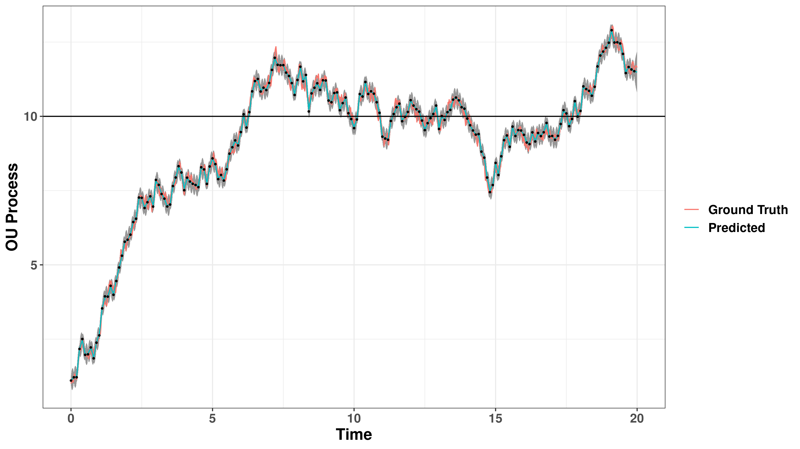

# Stochastic Differential Equation Modeling with TMB

This package contains examples and tools for performing inference on stochastic differential equation models.

- R package: `sdelib`
- `analysis/ornstein_uhlenbeck/`contains example analysis for an OU process.

## Examples

Example Ornstein-Uhlenbeck process (pink) observed with measurement error (dots) and inferred path (teal).

